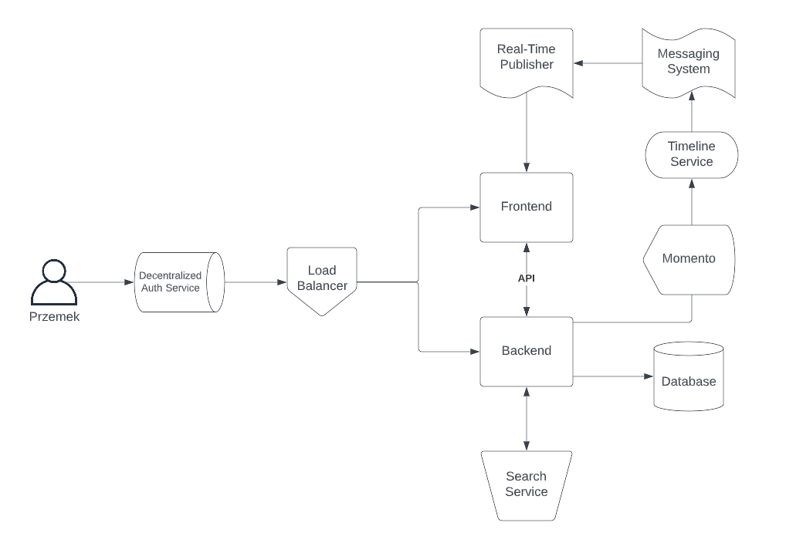
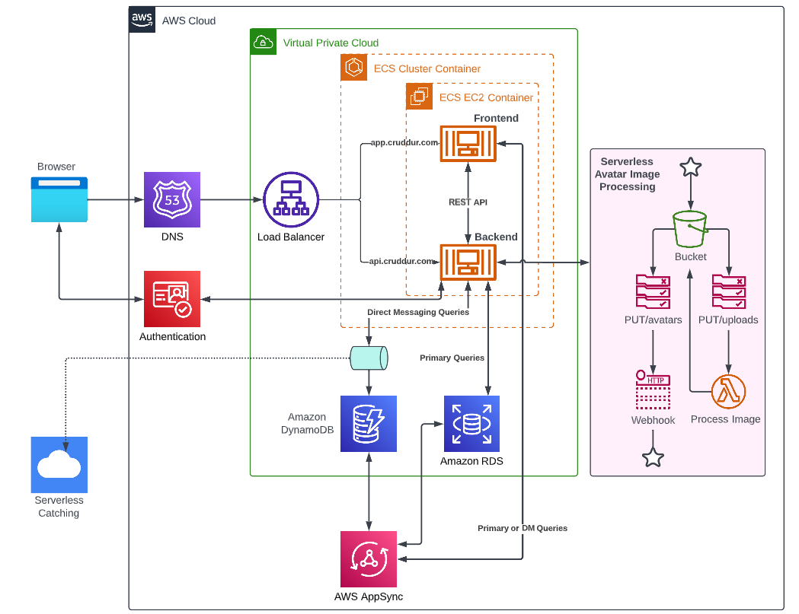
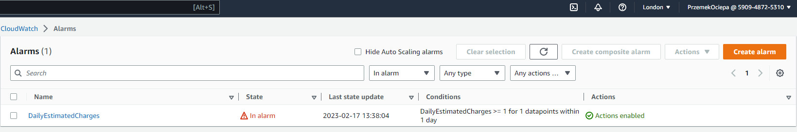
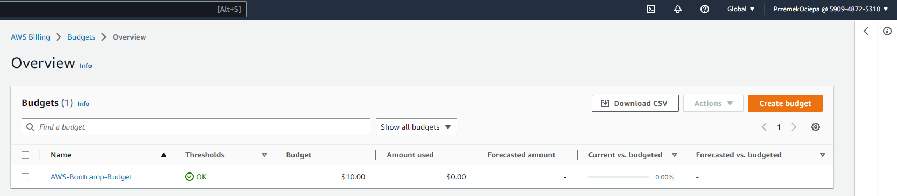

# Week 0 — Billing and Architecture

## Mandatory Homework

### Recreate Conceptual Diagram in Lucid Charts

Created the conceptual diagram using the basic shapes in Lucid.

[Conceptual Diagram Cruddur](https://lucid.app/lucidchart/4680fb4c-826a-4f89-9935-9730f567a9a8/edit?viewport_loc=-11%2C-57%2C2219%2C1097%2C0_0&invitationId=inv_0f2447d4-062d-42fe-8ac3-3d237b91c961)

### Recreate Logical Architectual Diagram in Lucid Charts

Recreated the logical diagram using AWS and other shapes in Lucid.

[Logical Diagram Cruddur](https://lucid.app/lucidchart/609e2c97-28a4-4b01-b8b1-b21f82ef44b2/edit?invitationId=inv_2b38ac48-a322-4903-bbcd-88d55cdd69ab)

### Installed AWS CLI

Followed the instructions and installed AWS CLI: [GitPod file](/.gitpod.yml)

### Create a Billing Alarm

Created a billing alarm with configuration in [Billing Alarm](/aws/json/alarm-config.json)

### Create a Budget

Created the AWS Bootcamp budget in [Budget](/aws/json/budget.json). It is set to $10 a month as I can afford to have a little bit of extra cost.

